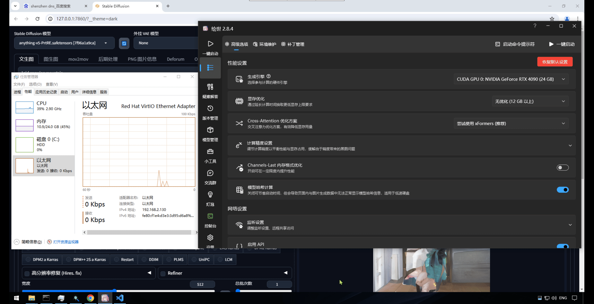

简体中文 | [English](README.md)

# 简介

Tensorlink 是一款基于CUDA API-Forwarding实现的分布式计算框架，当您的电脑没有显卡或显卡性能不足，Tensorlink可以帮助您轻松使用局域网内任意位置上的显卡资源。

# 示例
PS: 场景中展示的系统中没有实体显卡，使用tensolink链接处于另一个子网下的4090显卡

## 场景一：Stable Diffusion 使用远端显卡加速
图中展示了SD使用tensorlink进行计算的效果

## 场景二：Transformer LLM 使用远端显卡推理
图中展示了trnasformers框架使用tensorlink进行模型推理的效果

## 场景三：Cinma4D Octane插件 使用远端显卡渲染

# 路线图

- CUDA Runtime API Hook ✅
- CUDA Driver API Hook ✅
- CUDA cuBLAS Hook ✅
- CUDA cuDNN Hook ✅
- 支持客户端多进程 ✅
- 支持ZSTD数据压缩 ✅
- 支持Light(TCP+UDP)与Native(TCP+TCP)两种通信协议 ✅
- 支持单台服务器多卡计算
- 支持集群模式，整合多台机器的显卡资源

# 依赖

### Windows 客户端

1. 推荐安装python版本3.10
    ```python
    https://www.python.org/ftp/python/3.10.11/python-3.10.11-amd64.exe
    ```
2. 使用动态链接cuda runtime运行库的pytorch-2.1.2
    ```python
    https://github.com/nvwacloud/tensorlink/releases/download/deps/torch-2.1.2+cu121-cp310-cp310-win_amd64.whl
    pip install torch-2.1.2+cu121-cp310-cp310-win_amd64.whl
    ```
3. 安装Tensorlink CUDA依赖库，如果您的系统中已安装CUDA 12.1，可以跳过此步骤；
    ```python
    https://github.com/nvwacloud/tensorlink/releases/download/deps/tensorlink_cuda_deps.zip
    解压到任意目录后，将目录配置在系统的环境变量Path中；
    ```

### Linux 服务端

推荐系统：Rocky Linux 9.3 或 Ubuntu 2024.04

1. 安装CUDA 12.1
    https://developer.nvidia.com/cuda-12-1-0-download-archive

2. 安装CUDNN 8.8.1；
    https://developer.nvidia.com/downloads/compute/cudnn/secure/8.8.1/local_installers/12.0/cudnn-linux-x86_64-8.8.1.3_cuda12-archive.tar.xz/

3. 安装ZSTD 1.5.5及以上版本
    ```python
    wget https://github.com/facebook/zstd/releases/download/v1.5.6/zstd-1.5.6.tar.gz
    tar -xf zstd-1.5.6.tar.gz
    cd zstd-1.5.6
    make && make install
    ```

# 安装
下载最新版本Tensorlink
```python
https://github.com/nvwacloud/tensorlink/releases/
``` 

### Windows 客户端
  解压Tensorlink后，将client\windows目录下所有dll文件拷贝至system32目录下；
  ```python
  cd client\windows
  copy *.dll C:\Windows\System32
  ```
  <br><b>注意：如果出现cuda相关的dll文件冲突，请自行备份原文件</b>

### Linux 服务端
  解压Tensorlink后，将server\linux目录下所有文件拷贝至任意目录即可；

# 运行

### Linux 服务端（有显卡）
```python
./tensorlink -role server -net native -recv_port 9998 -send_port 9999
```
 

### Windows 客户端
```python
tensorlink.exe -role client -ip <服务端IP> -net native -send_port 9998 -recv_port 9999
```
  注意：服务端接收端口对应客户端发送端口，服务端发送端口对应客户端接收端口，两者端口以及协议必须一致。

### 检查运行状态
  使用python命令行，导入pytorch库，查看是否有远端显卡信息。
  

# 常见问题

1. <b>服务端启动时报错，缺少cudnn库文件</b>
  <br/>请检查cudnn库文件是否正确安装，如果通过压缩包安装，需要设置库文件路径相关的环境变量或者将库文件拷贝至/lib64目录下，否则程序可能无法找到库文件。

2. <b>客户端程序无响应</b>
  <br/>请检查客户端程序是否正确安装，vcuda主进程是否运行，可以通过DebugView进一步检查vcuda进程输出的相关信息。
