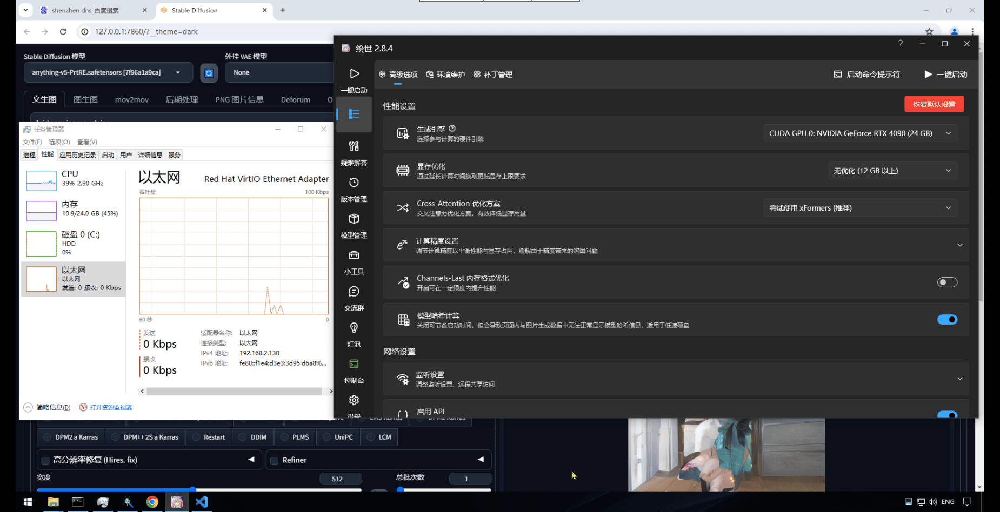
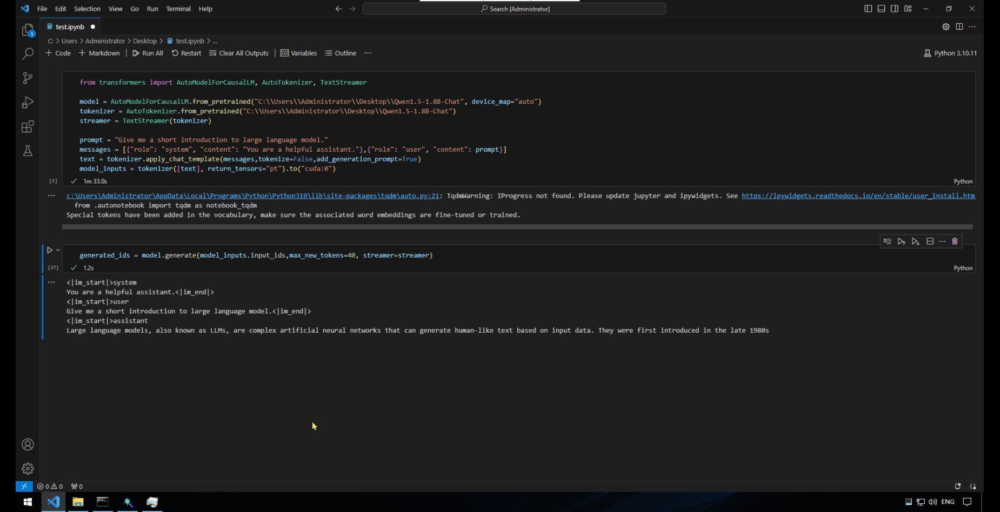
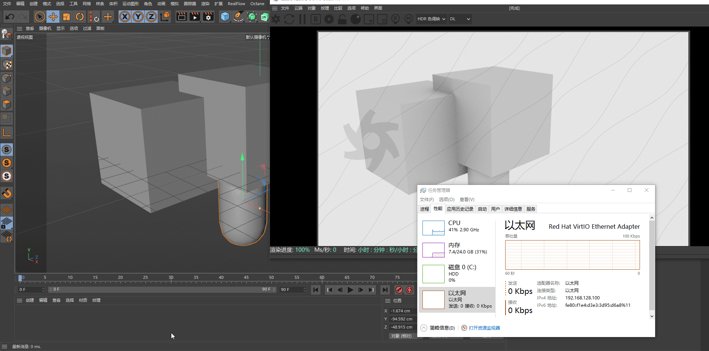
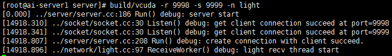
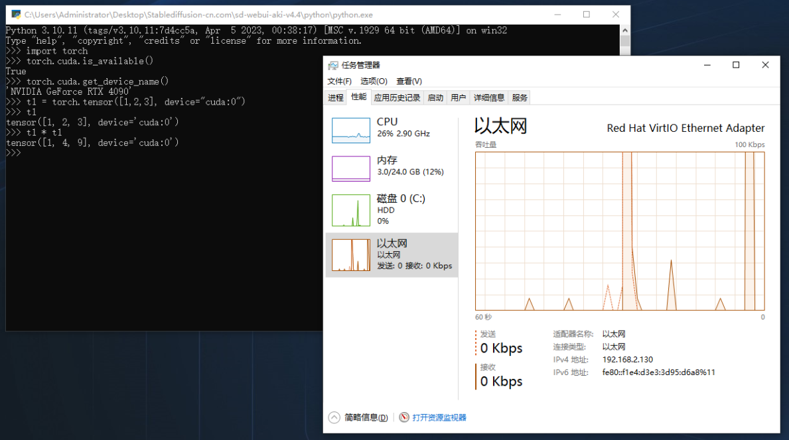

English | [简体中文](README-CN.md)

# Introduction

Tensorlink is a distributed computing framework based on CUDA API-Forwarding. When your computer lacks a GPU or its GPU performance is insufficient, Tensorlink allows you to easily utilize GPU resources from any location within the local area network.

# Examples

Note: The system shown in the scenarios does not have a physical GPU. It uses Tensorlink to connect to a 4090 GPU in another subnet.


## Scenario 1: Stable Diffusion Accelerated by Remote GPU

The image shows the effect of SD using Tensorlink for computation.



## Scenario 2: Transformer LLM Inference Using Remote GPU

The image shows the effect of the transformers framework using Tensorlink for model inference.



## Scenario 3: Cinema4D Octane Plugin Remote GPU Rendering


# Roadmap

- CUDA Runtime API Hook ✅
- CUDA Driver API Hook ✅
- CUDA cuBLAS Hook ✅
- CUDA cuDNN Hook ✅
- Support for Client Multi-Process ✅
- Support for ZSTD Data Compression ✅
- Support for Light (TCP+UDP) and Native (TCP+TCP) Communication Protocols ✅
- Support for Multi-GPU Computing on a Single Server
- Support for Cluster Mode, Integrating GPU Resources from Multiple Machines

# Dependences

## Windows Client

1. It is recommended to install Python version 3.10
    ```python
    https://www.python.org/ftp/python/3.10.11/python-3.10.11-amd64.exe
    ```

2. Use the dynamically linked CUDA runtime library Pytorch-2.1.2
    ```python
    https://github.com/nvwacloud/tensorlink/releases/download/deps/torch-2.1.2+cu121-cp310-cp310-win_amd64.whl
    pip install torch-2.1.2+cu121-cp310-cp310-win_amd64.whl
    ```

3. Install Tensorlink CUDA dependency library. If CUDA 12.1 is already installed on your system, you can skip this step.

    ```python
    https://github.com/nvwacloud/tensorlink/releases/download/deps/tensorlink_cuda_deps.zip
    ```
    Extract to any directory and configure the directory in the system environment variable Path.

## Linux Server

Recommended System: Rocky Linux 9.3 or Ubuntu 2024.04

1. Install CUDA 12.1 <br>https://developer.nvidia.com/cuda-12-1-0-download-archive

2. Install CUDNN 8.8.1 <br>https://developer.nvidia.com/downloads/compute/cudnn/secure/8.8.1/local_installers/12.0/cudnn-linux-x86_64-8.8.1.3_cuda12-archive.tar.xz/

3. Install ZSTD 1.5.5 or later

    ```python
    wget https://github.com/facebook/zstd/releases/download/v1.5.6/zstd-1.5.6.tar.gz
    tar -xf zstd-1.5.6.tar.gz
    cd zstd-1.5.6
    make && make install
    ```

# Installation

Download the latest version of Tensorlink
```python
https://github.com/nvwacloud/tensorlink/releases/
```

## Windows Client
After extracting, copy all DLL files from the client\windows directory to the system32 directory. 
  ```python
  cd client\windows
  copy *.dll C:\Windows\System32
  ```
<br><b>Note: If there is a conflict with existing CUDA-related DLL files, please back up the original files manually.</b>

## Linux Server
After extracting, copy all files from the server\Linux directory to any directory.

# Running

## Linux Server (with GPU)
```python
./tensorlink -role server -net native -recv_port 9998 -send_port 9999 
```


## Windows Client 
  
```python
tensorlink.exe -role client -ip 192.168.1.2 -net native -send_port 9998 -recv_port 9999
```

Note: The server's receiving port corresponds to the client's sending port, and the server's sending port corresponds to the client's receiving port. Both ports and protocols must be consistent.

## Check

Check if the program is running correctly <br>Use the Python command line to import the PyTorch library and check if there is remote GPU information.



FAQs

1. <b>Error on server startup, missing CUDNN library files</b> <br>Please check if the CUDNN library files are installed correctly. If installed via a compressed package, you need to set the library file path related environment variables or copy the library files to the /lib64 directory; otherwise, the program may not find the library files.

2. <b>Client program unresponsive</b> <br>Please check if the client program is installed correctly, if the vcuda main process is running, and use DebugView to further check the output information of the vcuda process.